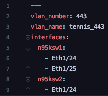

# dtcc_ansible
Ansible repo for the DTCC NetOps project

# What are these files and directories?

## plugins/filter
This is a collection of filter plugins. They are used to provide additional parsing and data manipulation not supplied 
by native Ansible.  Each filter has a brief description inside it.
 
## roles/parse_genie
This is the role which parses the NXOS output and puts data into a usable format. It comes from a separate repository and 
will be included when this repository is cloned. See .gitmodules below.

## test_vlans/dtcc
This contains the definitions for vlans.  Each vlan has one definition file.  The format of those files is discussed 
below. 

## .gitignore
This is a file instructing Git to ignore certain files

## .gitmodules
This file defines what other external repositories are to be included with this one when cloning.  That is, if you clone
this repository, the path in the .gitmodules file is included with it.  These are called submodules.

## ansible.cfg
The main config file for Ansible.  This tells Ansible where things like roles and plugins live.  It also contains the
path of the vault password file.

## create_vlan.yml
This creates vlans using input files found in `test_vlans/dtcc`

## delete_vlan.yml
This deletes a vlan using the same input files as `create_vlan.yml`

## dtcc_hosts
This file contains all the lab hosts Ansible knows about and how to reach them.  It also contains encrypted passwords.

## pipeline.groovy
This the pipeline definition for the Jenkins pipeline for `create_vlan.yml`

## README.md
This file.

## snapshot_host_config.yml
A small Ansible file to get a snapshot of the current running config of a Cisco switch

# What does an Ansible invocation look like? 
`/usr/local/bin/ansible-playbook -i ./dtcc_hosts ./create_vlan.yml --extra-vars='@test_vlans/dtcc/vlan_443.yml`

where:
1. `ansible-playbook` is the Ansible command 
1. `-i ./dtcc_hosts` is the hosts file (i.e. which hosts we will use and how to access them)
1. `create_vlan.yml` is the Ansible script being called 
1. `--extra-vars='@test_vlans/dtcc/vlan_443.yml` is the file containing the vlan definition

# vlan file & its format
## file name 
The vlan definition file *must* start with `vlan_` followed by the vlan number, then `.yml` 

examples
`vlan_1400.yml` or `vlan_3.yml` or `vlan_293.yml`

## file content 
All the content described below is mandatory
1. Line 1 - 3 dashes indicating the beginning of the document 
1. Line 2 - The vlan number 
1. Line 3 - The vlan name 
1. Line 4 - The `interfaces` keyword
1. Line 5 - A switch name (indented 2 spaces)
1. Line 6 - An interface from the above switch (indented 4 spaces)

Repeat the last 2 lines for as many switches and interfaces as you would like to add. 

Example:



# Vault passwords 
## How to setup a vault password 
1. Create a file which contains a password you have chosen (ex `~/.vault_password_file`)
1. Encrypt a string using this password file <br>
`ansible-vault encrypt_string --vault-password-file ~/.vault_password_file 'foobar' --name 'a_secret'`
<br>where<br>
`foobar` is the string you want to encrypt<br>
`a_secret` is the name of the variable for that string<br>
<br>The output will look something like this<br>
```yaml
a_secret: !vault |
          $ANSIBLE_VAULT;1.1;AES256
          61393037346262346431336136346263383731663163363331373037623564623737373564373037
          3233633431323962376634653335386133393366656631610a313262373731663966323066333032
          38393734363832663737336361376536373332646166643961333761303261666432653930303261
          6230336131336661650a663236666634333730636239636231633464313837363034363238653961
          3861
```
**NOTE** If you don't want your shell history to show the values you have encrypted, just put a space before `ansible-vault`
and it will not be saved in your history.

# How to verify your data was properly encrypted
1. Take the output above and put it into a file called `var.yml`.
1. Run this command<br>`ansible localhost -m debug -a var="a_secret" -e "@var.yml" --vault-password-file ~/.vault_password_file`
1. The output should be something like this<br> 
```yaml
localhost | SUCCESS => {
    "a_secret": "foobar"
}
```

# How does the Jenkins process work?

